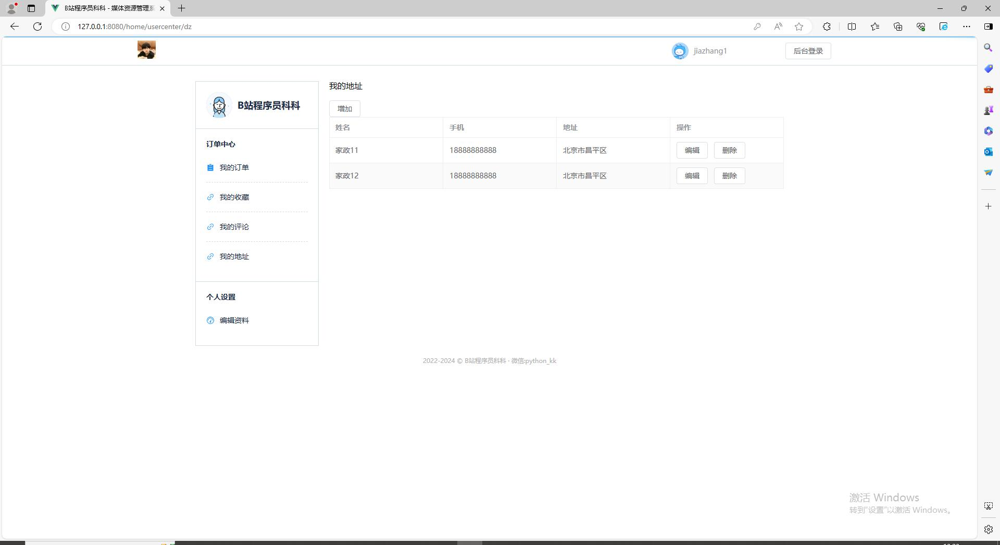

# 基于Python+Django+Vue的家政预约家政预定推荐系统设计与实现


> 一直想做一款管理系统，前几天看了一位开源大佬的前端vue结构，使用vue3+elementui重构了一下前台和后台，django后台使用了Apiview进行增删改查。并且在原来的功能上加入了轮播图管理，商品审核，评论审核，echarts可视化，协同过滤算法推荐等功能，本着开源的精神，现在把部分源码开源，如需完整源码，可以联系作者微信：python_kk


**如果自己下载源码后遇到问题无法解决（前后端衔接、报错、找不到文件位置，不知道怎么修改，想简单修改做毕设，想简单修改给别人做毕设）等问题都可以联系作者微信：python_kk**


### 演示地址（为了保证大家体验，所有将除get请求以外请求都禁止了，所以无法增加修改删除是正常现象）


前台地址： [https://dvjiazheng.ake999.com](https://dvjiazheng.ake999.com)

后台地址：https://dvjiazheng.ake999.com/login


后台体验账号密码：（需要注意，如果想体验管理，需要在下拉选择管理，也就是第一个）

账号：admin

密码：admin


前台体验账号密码：（需要注意，如果想体验家长，需要在下拉选择用户，也就是最后一个）

账号：jiazhang1

密码：jiazhang1


### 运行截图

前台：





后台：


### 功能介绍

- 前台功能包括：首页、详情页、订单、用户中心、分类管理，地区管理。
- 后台功能包括：首页、轮播图管理、管理员、老板管理、家政管理、家政管理、订单管理、地址管理
- 付费功能（收藏管理，评论管理，家政审核，评论审核，协同过滤算法推荐）

### 代码结构

- django_vue_jiazheng目录是后端代码
- django_vue_jiazheng_front目录是前端代码


#### 后端运行步骤

pip install -r utils/requ.txt

python manage.py runserver

后端接口地址8000 不要改变


#### 前端运行步骤


进入django_vue_jiazheng_front目录下，安装依赖，执行:

```
npm install 
```

```
npm run dev
```

localhost:8080可以访问


需要付费指导联系微信：python_kk